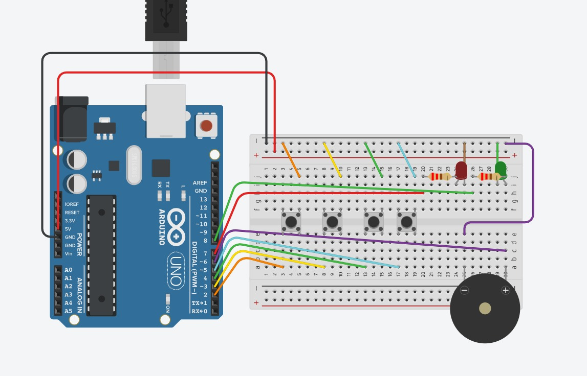
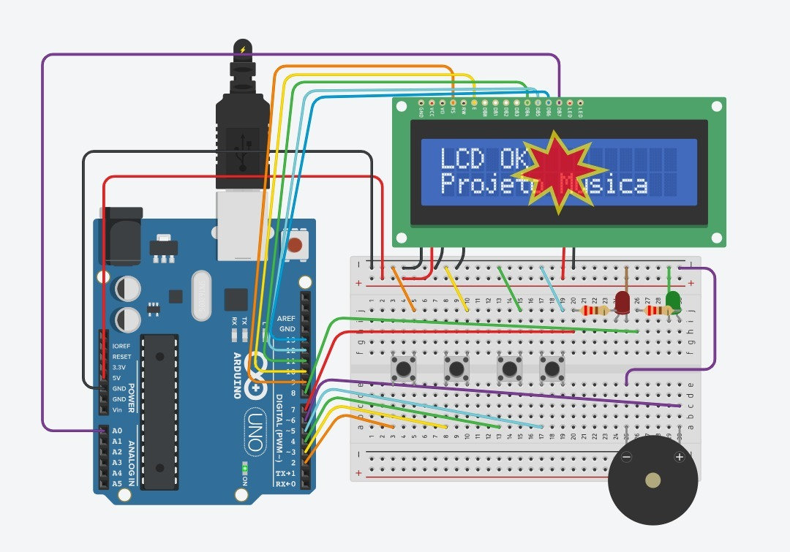
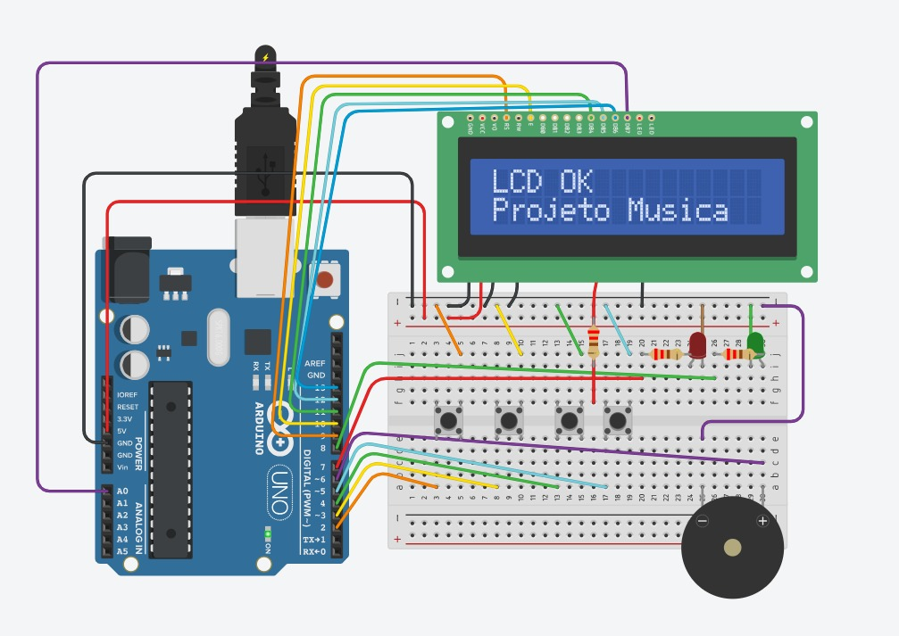
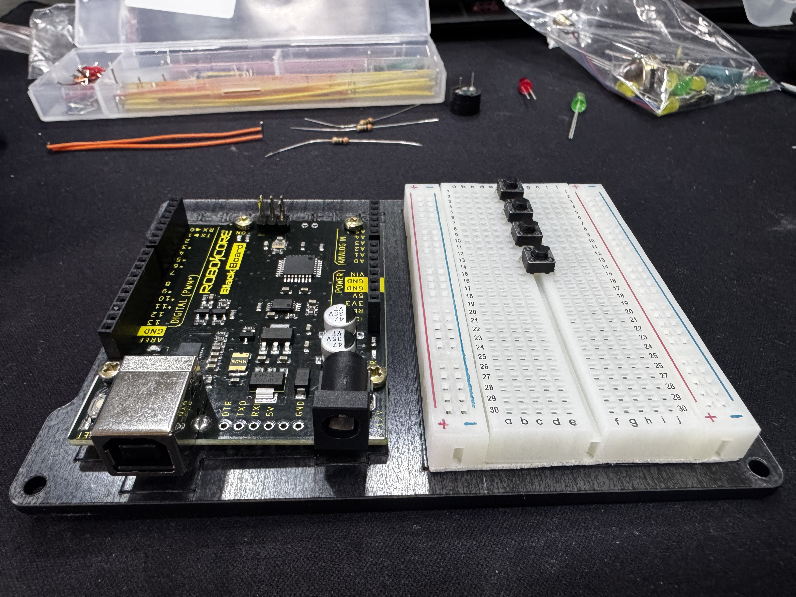
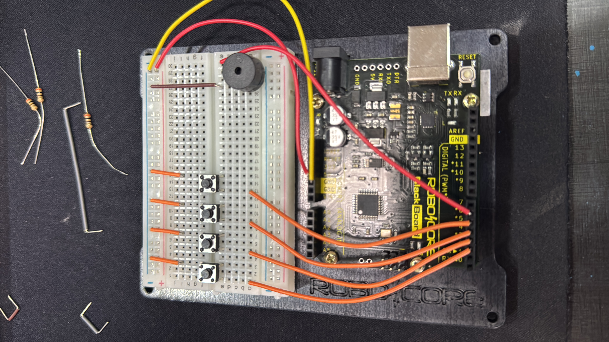
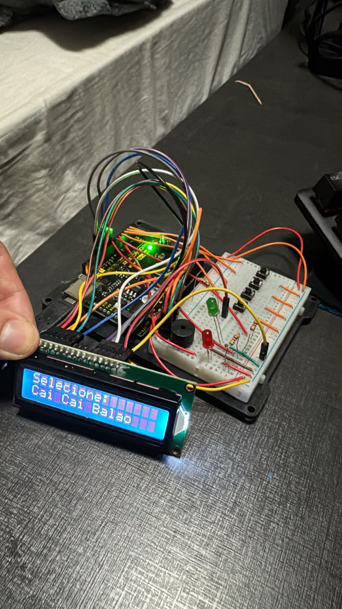

                              
# Reprodutor de Músicas com Arduino Uno

## 1. Objetivo do Projeto

Este projeto tem como objetivo desenvolver um reprodutor de músicas utilizando Arduino Uno, com navegação por botões, saída sonora por buzzer, sinalização visual por LEDs e exibição das informações em um display LCD 16x2.

O sistema foi projetado para permitir que o usuário selecione uma música no menu principal, inicie a reprodução, pause a execução, retome a música e interrompa o funcionamento a qualquer momento, retornando ao menu. Além disso, o projeto foi estruturado de forma a respeitar as limitações de memória do Arduino Uno, armazenando as músicas na memória FLASH.

## 2. Descrição Geral

O projeto foi desenvolvido com base nos requisitos da disciplina, que exigiam:

- no mínimo 5 músicas armazenadas;
- 4 botões:
  - botão para navegar para cima;
  - botão para navegar para baixo;
  - botão de play/pause;
  - botão de stop;
- reprodução da música por buzzer;
- uso de 2 LEDs para indicar os estados de reprodução e pausa;
- uso de display LCD 16x2;
- documentação do projeto no README do GitHub.  

O sistema foi dividido em três estados principais:

- **MENU**
- **TOCANDO**
- **PAUSADO**

Essa organização facilitou a implementação da lógica e tornou o comportamento dos botões mais previsível e fácil de manter.

## 3. Metodologia

### 3.1 Planejamento inicial

O desenvolvimento foi feito de forma incremental, começando pela base do hardware e pela validação dos componentes mais simples, antes de integrar toda a lógica do projeto.

A ordem de desenvolvimento seguiu, de forma resumida, estas etapas:

1. montagem da base física do circuito;
2. validação dos botões;
3. validação dos LEDs;
4. validação do buzzer;
5. construção do menu;
6. implementação dos estados do sistema;
7. implementação das músicas;
8. armazenamento das músicas na memória FLASH;
9. integração do LCD;
10. refinamento final do código.

### 3.2 Materiais utilizados

- Arduino Uno
- Protoboard
- Suporte de montagem 
- 4 push buttons
- 2 LEDs
- Resistores para os LEDs
- 1 buzzer piezoelétrico
- 1 display LCD 16x2
- Jumpers Flexiveis
- Jumpers Rigidos
- Tinkercad Circuits
- Componentes físicos para montagem real

### 3.3 Tecnologias aplicadas

As principais tecnologias e recursos utilizados foram:

- **Arduino / C++** para o desenvolvimento da lógica do sistema;
- **Tinkercad Circuits** para prototipação e simulação inicial;
- **Display LCD 16x2** como interface principal do usuário;
- **PROGMEM / memória FLASH** para armazenar as músicas sem sobrecarregar a RAM;
- **Debounce por software** para estabilizar a leitura dos botões;
- **GitHub** para versionamento do projeto e registro da evolução.

### 3.4 Desenvolvimento no Tinkercad

A primeira versão do projeto foi desenvolvida e testada no Tinkercad, pois inicialmente não havia necessidade de depender do hardware físico para validar a lógica básica do sistema.

Nessa fase, foram montados:

- os 4 botões de controle;
- os 2 LEDs de estado;
- o buzzer;
- o display LCD 16x2;
- a protoboard com alimentação e interligações.

#### Imagens do processo de montagem no Thinkercard
#### Montagem inicial

#### Alerta de tensão no LCD

#### Colocado resistor em série para ligar LED do LCD no 5V direto

### 3.5 Desenvolvimento físico

Após a validação da simulação, o projeto também foi montado fisicamente e testado em funcionamento real. Isso foi importante para confirmar que o sistema não funcionava apenas no ambiente virtual, mas também no circuito real com Arduino, botões, buzzer, LEDs e LCD.

#### Imagens do processo de montagem física
#### Prontoboard e Arduino fixados no suporte RoboCore

#### Botões e buzzer ligados com fio rígido

#### Projeto Finalizado com LCD e LEDS

## 4. Explicações Técnicas Importantes

### 4.1 Armazenamento das músicas na memória FLASH

O Arduino Uno possui apenas **2 KB de RAM**, o que torna inviável armazenar muitas sequências de notas diretamente na memória principal se o projeto crescer. Por esse motivo, as músicas foram armazenadas na **memória FLASH**, utilizando `PROGMEM`.

Na prática, isso permitiu:

- manter 5 músicas no sistema;
- economizar RAM;
- evitar desperdício de memória durante a execução.

Cada música foi organizada em dois vetores:

- um vetor contendo as **notas**;
- um vetor contendo os **tempos** de cada nota.

### 4.2 Debounce dos botões

Durante o desenvolvimento, foi utilizado **debounce por software** na leitura dos botões.

Isso foi necessário porque, ao pressionar um botão físico, o sinal não muda de forma perfeitamente limpa: durante alguns milissegundos podem ocorrer oscilações mecânicas, fazendo o Arduino interpretar um único toque como vários cliques seguidos.

O debounce foi implementado para:

- evitar trocas duplas de música no menu;
- impedir pausas e retomadas involuntárias;
- tornar a interface mais estável e previsível.

### 4.3 Uso do LCD sem potenciômetro

Em muitos projetos com LCD 16x2, é comum utilizar um potenciômetro para ajustar o contraste do display. No entanto, neste projeto isso não foi necessário.

No ambiente de simulação utilizado, foi possível obter contraste suficiente ligando o pino de contraste do LCD diretamente ao GND, o que permitiu visualizar corretamente o texto sem precisar de ajuste fino manual.

Por isso, optou-se por não utilizar potenciômetro, mantendo o circuito mais simples e funcional.

### 4.4 Problema encontrado no backlight do LCD no Tinkercad

Durante a montagem no Tinkercad, o LCD foi inicialmente ligado com a iluminação do display diretamente no positivo. Isso fez com que o simulador emitisse um alerta de excesso de corrente, representado pelo ícone de “explosão”.

O problema ocorreu porque o LED interno do backlight estava recebendo corrente sem limitação adequada.

A correção foi feita inserindo **um resistor em série no caminho da alimentação do backlight**, o que eliminou o alerta e permitiu o funcionamento correto do display com segurança.

Essa etapa foi importante porque demonstrou, na prática, a necessidade de limitar corrente em componentes luminosos.

## 5. Funcionamento do Sistema

O projeto final funciona da seguinte forma:

### 5.1 Estado de menu
Ao ligar o sistema, o LCD exibe a tela de seleção de músicas.  
Os botões **cima** e **baixo** permitem navegar entre as cinco músicas disponíveis.

### 5.2 Estado de reprodução
Ao pressionar o botão **play**, a música selecionada começa a tocar no buzzer.  
Nesse momento:

- o LCD informa que a música está tocando;
- o LED de reprodução é aceso.

### 5.3 Estado de pausa
Se o botão **play** for pressionado novamente durante a reprodução:

- a música é pausada;
- o buzzer é interrompido temporariamente;
- o LED de pausa é aceso;
- o LCD passa a exibir o estado pausado.

### 5.4 Retomada
Ao pressionar novamente o botão **play**, a música volta a tocar a partir do ponto em que estava.

### 5.5 Stop
Ao pressionar o botão **stop**, o sistema:

- encerra a música atual;
- apaga a sinalização de reprodução/pausa;
- retorna ao menu principal.

## 6. Repertório Final

As músicas utilizadas no projeto foram:

1. Cai Cai Balão
2. Brilha Brilha
3. Dona Aranha
4. Tema do Gás
5. Ciranda

Todas foram organizadas em vetores de notas e tempos, com execução sequencial no buzzer.

## 7. Experimentos, Testes e Validações

Durante o desenvolvimento, foram realizados testes graduais para validar cada etapa do sistema.

### 7.1 Testes realizados

- leitura correta dos 4 botões;
- troca de músicas no menu;
- acionamento do buzzer;
- funcionamento do LED de reprodução;
- funcionamento do LED de pausa;
- pausa e retomada da música;
- interrupção com botão stop;
- exibição correta das informações no LCD;
- validação das músicas armazenadas na FLASH;
- funcionamento no Tinkercad;
- funcionamento no protótipo físico.

### 7.2 Fotos dos testes

#### Teste do menu no LCD

#### Teste da reprodução

#### Teste da pausa

#### Montagem física completa

### 7.3 Vídeos de funcionamento do projeto
        
#### Funcionamento no Thikercard
https://github.com/user-attachments/assets/e9802cca-5e34-416f-aa9d-693427bc1fad

#### Funcionamento no Físico
https://github.com/user-attachments/assets/3c465a5f-19dd-4980-ae10-af4d465c2807

## 8. Linha do Tempo dos Commits

> **Observação:** esta seção resume a evolução do projeto ao longo do desenvolvimento.

### Commit 1 — estrutura inicial com lcd pinos e estados
Base inicial do projeto com definição dos pinos, criação da estrutura principal do sistema e configuração inicial do LCD.

### Commit 2 — menu inicial com troca de musicas no lcd
Implementação da navegação entre músicas com os botões de cima e baixo, já utilizando o LCD como interface visual.

### Commit 3 — play pausa e stop com leds e tom de teste
Validação dos estados principais do projeto com uso dos LEDs e um tom simples no buzzer.

### Commit 4 — primeira musica em vetor com reproducao nota por nota
Substituição do tom contínuo por uma primeira música real tocando nota por nota.

### Commit 5 — musicas movidas para flash com progmem
Reestruturação das músicas para armazenamento em memória FLASH, reduzindo o uso da RAM do Arduino Uno.

### Commit 6 — adicionadas cinco musicas finais em flash
Inclusão do repertório final com cinco músicas selecionáveis pelo menu.

### Commit 7 — duracao das musicas balanceada para cerca de 5 segundos
Padronização do tempo total das músicas para melhorar a experiência de teste e apresentação.

### Commit 8 — refinamento final dos nomes e limpeza da versao entregue
Ajustes finais de legibilidade do código, limpeza da interface e consolidação da versão final do sistema.

## 9. Conclusão

O projeto foi concluído com sucesso, atendendo aos principais requisitos propostos. Foi possível desenvolver um sistema embarcado funcional, com interface por botões, sinalização por LEDs, reprodução musical em buzzer e exibição de informações em LCD 16x2.

Além da parte funcional, o projeto também contribuiu para o aprendizado de conceitos importantes, como:

- organização por estados;
- leitura estável de botões com debounce;
- uso da memória FLASH;
- integração entre hardware e software;
- depuração em ambiente simulado e físico.

O desenvolvimento em etapas foi essencial para garantir que cada parte fosse validada separadamente antes da integração total, o que tornou o processo mais seguro, organizado e compreensível.
